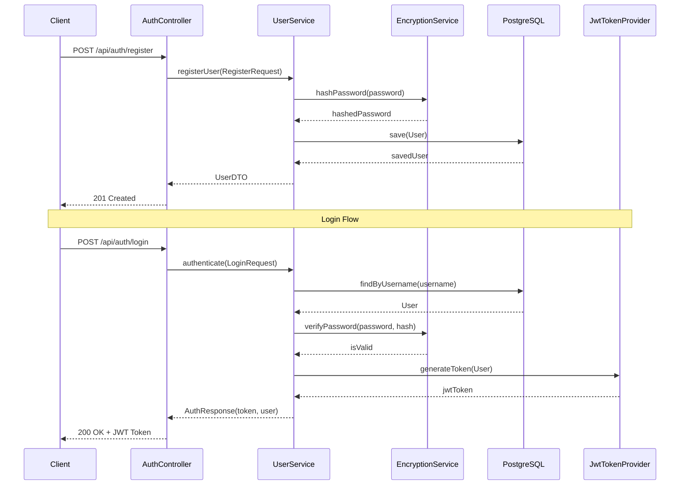
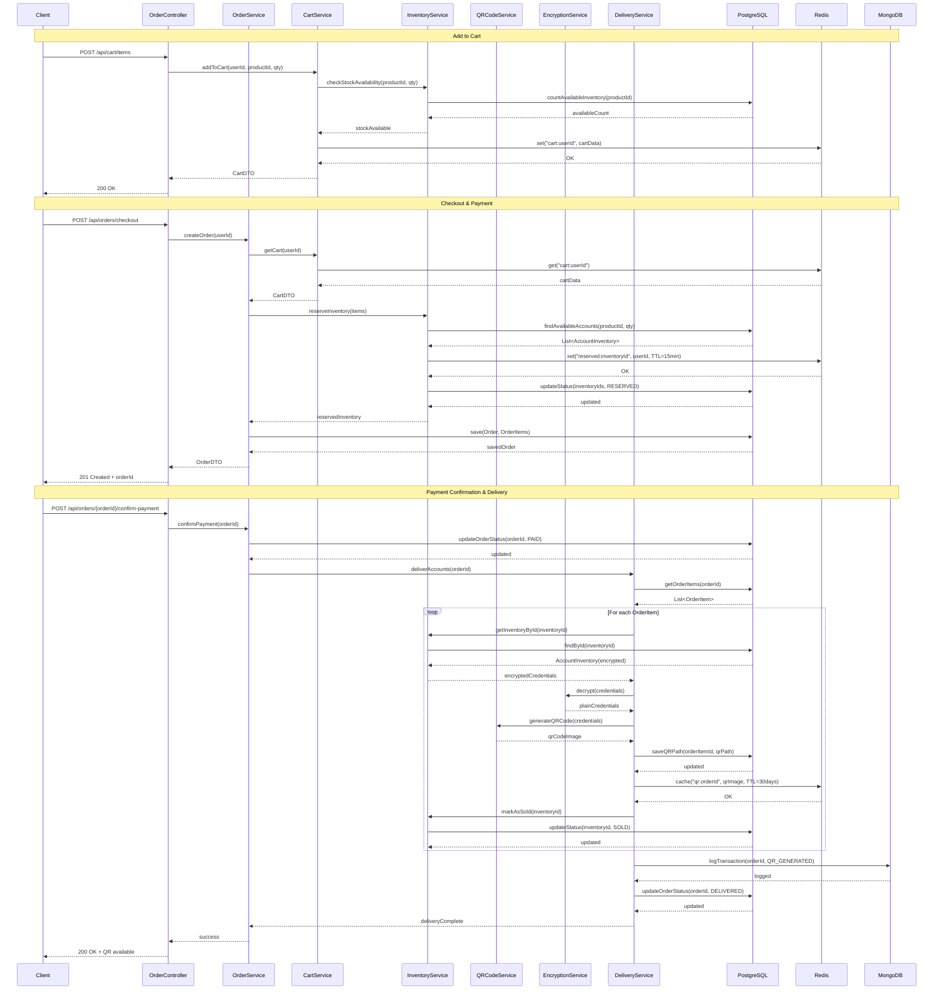
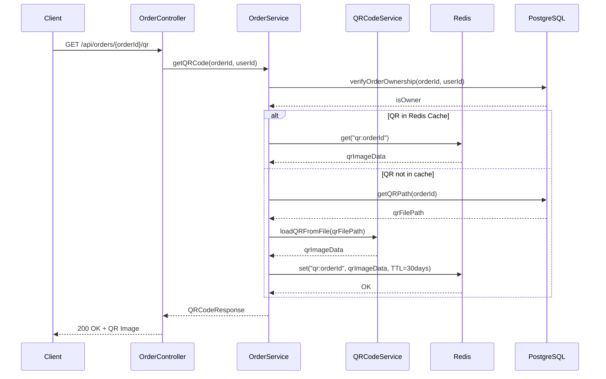
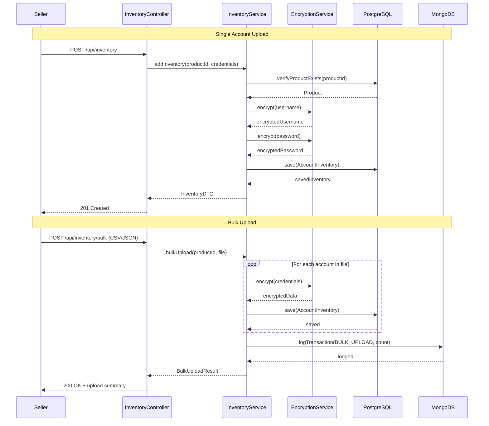
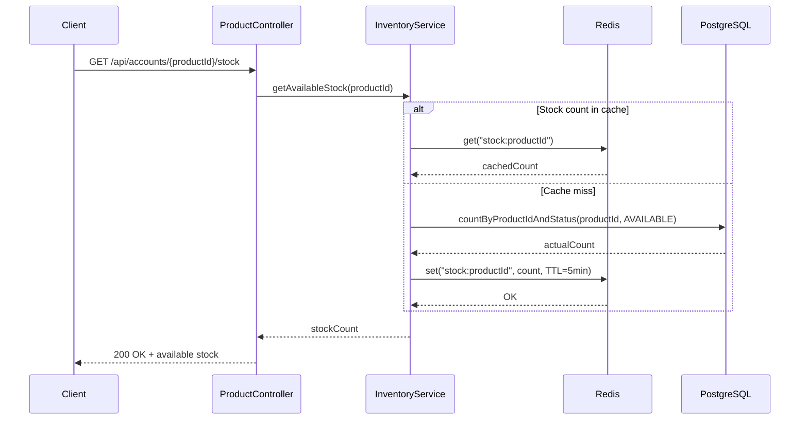
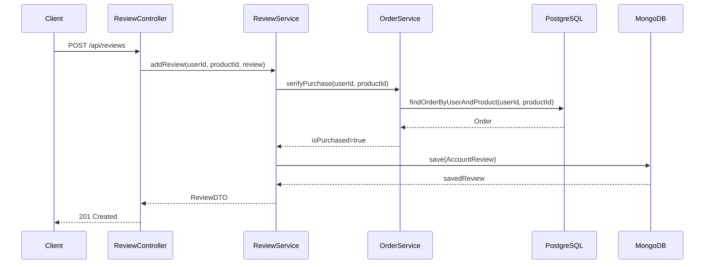

# E-Commerce Internship Project Recommendation

## Project Overview: **AccountHub** - Virtual Goods Marketplace

A full-stack e-commerce platform for selling virtual goods (gaming accounts, streaming subscriptions, software licenses, etc.) with automated delivery via QR codes containing login credentials.

---

## 🎯 Project Scope (Internship-Friendly)

This project is designed to be completable in **6-8 weeks** and demonstrates real-world application development skills.

### Core Features

1. **User Management**
   - User registration and login (JWT authentication)
   - User profile management
   - Purchase history 
   - Role-based access (Customer, Seller, Admin)

2. **Virtual Goods Catalog**
   - Browse accounts by category (Gaming, Streaming, Software, etc.)
   - Search and filter accounts
   - View account details (platform, features, warranty)
   - Product ratings and reviews

3. **Shopping Cart**
   - Add/remove items
   - Quantity selection (for bulk purchases)
   - Cart persistence (Redis)
   - Real-time stock availability

4. **Purchase & Delivery System**
   - Secure checkout process
   - **Automated QR code generation** with encrypted login credentials
   - Instant delivery upon payment confirmation
   - Order history with downloadable QR codes
   - Account credential encryption

5. **Account Inventory Management**
   - Stock management for virtual accounts
   - Automatic stock deduction on purchase
   - Account status tracking (Available, Sold, Reserved)

6. **Admin/Seller Panel**
   - Add/upload account credentials
   - Manage inventory
   - View sales analytics
   - Track delivered accounts

---

## 🏗️ Architecture Overview

```
┌─────────────┐         ┌──────────────────┐         ┌─────────────────┐
│   Angular   │ ◄─────► │  Spring Boot API │ ◄─────► │   PostgreSQL    │
│  (Frontend) │  HTTP   │    (Backend)     │         │  (Main Data)    │
└─────────────┘         └──────────────────┘         └─────────────────┘
                               │                              
                               ├──────────► ┌─────────────────┐
                               │            │     MongoDB     │
                               │            │ (Reviews/Logs)  │
                               │            └─────────────────┘
                               │
                               └──────────► ┌─────────────────┐
                                            │      Redis      │
                                            │  (Cart/Session) │
                                            └─────────────────┘
```

---

## � Backend Sequence Diagrams

### 1. User Registration & Authentication Flow



### 2. Complete Purchase Flow with QR Code Generation



### 3. Retrieve QR Code Flow



### 4. Seller Inventory Upload Flow



### 5. Stock Availability Check Flow



### 6. Review Submission Flow (MongoDB)



---

## �💾 Database Design

### PostgreSQL (Relational Data)

**Tables:**

1. **users**
   - id (PK)
   - username
   - email
   - password_hash
   - role (CUSTOMER, SELLER, ADMIN)
   - created_at
   - updated_at

2. **account_products**
   - id (PK)
   - name (e.g., "Netflix Premium Account")
   - description
   - platform (e.g., "Netflix", "Steam", "Spotify")
   - price
   - category_id (FK)
   - features (JSON - e.g., {"duration": "1 month", "region": "Global"})
   - image_url
   - warranty_days
   - created_at
   - updated_at

3. **categories**
   - id (PK)
   - name (e.g., "Gaming", "Streaming", "Software", "VPN")
   - description
   - icon_url

4. **account_inventory**
   - id (PK)
   - product_id (FK)
   - username (encrypted)
   - password (encrypted)
   - additional_info (encrypted JSON - recovery email, etc.)
   - status (AVAILABLE, SOLD, RESERVED, INVALID)
   - added_at
   - sold_at

5. **orders**
   - id (PK)
   - user_id (FK)
   - total_amount
   - status (PENDING, PAID, DELIVERED, CANCELLED, REFUNDED)
   - payment_method
   - created_at
   - updated_at

6. **order_items**
   - id (PK)
   - order_id (FK)
   - product_id (FK)
   - inventory_id (FK) -- Links to the actual account delivered
   - quantity
   - price_at_purchase
   - qr_code_path (path to generated QR code image)
   - delivered_at

### MongoDB (Document-Based Data)

**Collections:**

1. **account_reviews**
   ```json
   {
     "_id": "ObjectId",
     "productId": "Long",
     "userId": "Long",
     "orderId": "Long",
     "rating": "Integer (1-5)",
     "comment": "String",
     "isVerifiedPurchase": "Boolean",
     "accountWorking": "Boolean",
     "createdAt": "Date"
   }
   ```

2. **transaction_logs**
   ```json
   {
     "_id": "ObjectId",
     "orderId": "Long",
     "userId": "Long",
     "action": "String (PURCHASE, QR_GENERATED, DELIVERED, REFUND)",
     "details": {
       "productName": "String",
       "amount": "Number",
       "qrCodeGenerated": "Boolean",
       "deliveryMethod": "String"
     },
     "ipAddress": "String",
     "timestamp": "Date"
   }
   ```

### Redis (Caching & Session)

**Key-Value Structures:**

1. **Shopping Cart**
   - Key: `cart:userId`
   - Value: JSON array of cart items
   - TTL: 7 days

2. **Session Data**
   - Key: `session:sessionId`
   - Value: User session info
   - TTL: 24 hours

3. **Account Reservations** (Prevent double-selling during checkout)
   - Key: `reserved:inventoryId`
   - Value: userId
   - TTL: 15 minutes

4. **QR Code Cache**
   - Key: `qr:orderId`
   - Value: Base64 encoded QR image
   - TTL: 30 days

---

## 🔧 Backend: Java Spring Boot

### Project Structure

```
src/main/java/com/accounthub/
├── config/
│   ├── SecurityConfig.java
│   ├── RedisConfig.java
│   ├── MongoConfig.java
│   └── EncryptionConfig.java
├── controller/
│   ├── AuthController.java
│   ├── AccountProductController.java
│   ├── CartController.java
│   ├── OrderController.java
│   ├── ReviewController.java
│   └── InventoryController.java
├── service/
│   ├── UserService.java
│   ├── AccountProductService.java
│   ├── CartService.java
│   ├── OrderService.java
│   ├── ReviewService.java
│   ├── InventoryService.java
│   ├── QRCodeService.java
│   ├── EncryptionService.java
│   └── DeliveryService.java
├── repository/
│   ├── postgres/
│   │   ├── UserRepository.java
│   │   ├── AccountProductRepository.java
│   │   ├── OrderRepository.java
│   │   ├── OrderItemRepository.java
│   │   ├── InventoryRepository.java
│   │   └── CategoryRepository.java
│   └── mongo/
│       ├── ReviewRepository.java
│       └── TransactionLogRepository.java
├── model/
│   ├── entity/
│   │   ├── User.java
│   │   ├── AccountProduct.java
│   │   ├── AccountInventory.java
│   │   ├── Order.java
│   │   ├── OrderItem.java
│   │   └── Category.java
│   └── document/
│       ├── AccountReview.java
│       └── TransactionLog.java
├── dto/
│   ├── LoginRequest.java
│   ├── RegisterRequest.java
│   ├── AccountProductDTO.java
│   ├── OrderDTO.java
│   ├── PurchaseResponse.java
│   └── QRCodeResponse.java
├── security/
│   ├── JwtTokenProvider.java
│   └── JwtAuthenticationFilter.java
├── util/
│   ├── QRCodeGenerator.java
│   └── CredentialEncryptor.java
└── AccountHubApplication.java
```

### Key Dependencies (pom.xml)

```xml
<dependencies>
    <!-- Spring Boot Starters -->
    <dependency>
        <groupId>org.springframework.boot</groupId>
        <artifactId>spring-boot-starter-web</artifactId>
    </dependency>
    <dependency>
        <groupId>org.springframework.boot</groupId>
        <artifactId>spring-boot-starter-data-jpa</artifactId>
    </dependency>
    <dependency>
        <groupId>org.springframework.boot</groupId>
        <artifactId>spring-boot-starter-data-mongodb</artifactId>
    </dependency>
    <dependency>
        <groupId>org.springframework.boot</groupId>
        <artifactId>spring-boot-starter-data-redis</artifactId>
    </dependency>
    <dependency>
        <groupId>org.springframework.boot</groupId>
        <artifactId>spring-boot-starter-security</artifactId>
    </dependency>
    
    <!-- Database Drivers -->
    <dependency>
        <groupId>org.postgresql</groupId>
        <artifactId>postgresql</artifactId>
    </dependency>
    
    <!-- JWT -->
    <dependency>
        <groupId>io.jsonwebtoken</groupId>
        <artifactId>jjwt</artifactId>
        <version>0.9.1</version>
    </dependency>
    
    <!-- Lombok (Optional, for cleaner code) -->
    <dependency>
        <groupId>org.projectlombok</groupId>
        <artifactId>lombok</artifactId>
    </dependency>
    
    <!-- QR Code Generation -->
    <dependency>
        <groupId>com.google.zxing</groupId>
        <artifactId>core</artifactId>
        <version>3.5.1</version>
    </dependency>
    <dependency>
        <groupId>com.google.zxing</groupId>
        <artifactId>javase</artifactId>
        <version>3.5.1</version>
    </dependency>
</dependencies>
```

### API Endpoints

#### Authentication
- `POST /api/auth/register` - Register new user
- `POST /api/auth/login` - Login and get JWT token

#### Account Products
- `GET /api/accounts` - Get all account products (with pagination & filters)
- `GET /api/accounts/{id}` - Get account product details
- `GET /api/accounts/category/{categoryId}` - Get accounts by category
- `GET /api/accounts/search?q={query}` - Search account products
- `GET /api/accounts/{id}/stock` - Check available stock
- `POST /api/accounts` - Create account product (Admin/Seller only)
- `PUT /api/accounts/{id}` - Update account product (Admin/Seller only)
- `DELETE /api/accounts/{id}` - Delete account product (Admin only)

#### Inventory Management
- `POST /api/inventory` - Add account credentials to inventory (Admin/Seller)
- `POST /api/inventory/bulk` - Bulk upload accounts (CSV/JSON)
- `GET /api/inventory/product/{productId}` - Get available inventory for product
- `PUT /api/inventory/{id}/status` - Update inventory status
- `DELETE /api/inventory/{id}` - Remove from inventory

#### Cart
- `GET /api/cart` - Get user's cart
- `POST /api/cart/items` - Add item to cart (checks stock availability)
- `PUT /api/cart/items/{productId}` - Update item quantity
- `DELETE /api/cart/items/{productId}` - Remove item from cart
- `DELETE /api/cart` - Clear cart

#### Orders & Delivery
- `POST /api/orders/checkout` - Create order and process payment
- `GET /api/orders` - Get user's order history
- `GET /api/orders/{id}` - Get order details
- `GET /api/orders/{id}/qr` - **Generate/retrieve QR code with credentials**
- `GET /api/orders/{id}/download` - Download QR code image
- `POST /api/orders/{id}/confirm-payment` - Confirm payment (triggers delivery)
- `PUT /api/orders/{id}/status` - Update order status (Admin only)

#### Reviews
- `POST /api/reviews` - Add account review (verified purchase only)
- `GET /api/reviews/product/{productId}` - Get product reviews
- `PUT /api/reviews/{id}` - Update review
- `DELETE /api/reviews/{id}` - Delete review

---

## 🎨 Frontend: Angular + Bootstrap

### Project Structure

```
src/
├── app/
│   ├── core/
│   │   ├── guards/
│   │   │   ├── auth.guard.ts
│   │   │   └── seller.guard.ts
│   │   ├── interceptors/
│   │   │   └── jwt.interceptor.ts
│   │   └── services/
│   │       ├── auth.service.ts
│   │       ├── account-product.service.ts
│   │       ├── cart.service.ts
│   │       ├── order.service.ts
│   │       ├── inventory.service.ts
│   │       └── qr-code.service.ts
│   ├── shared/
│   │   ├── components/
│   │   │   ├── navbar/
│   │   │   ├── footer/
│   │   │   ├── qr-code-display/
│   │   │   └── stock-badge/
│   │   └── models/
│   │       ├── user.model.ts
│   │       ├── account-product.model.ts
│   │       ├── order.model.ts
│   │       └── inventory.model.ts
│   ├── features/
│   │   ├── auth/
│   │   │   ├── login/
│   │   │   └── register/
│   │   ├── accounts/
│   │   │   ├── account-list/
│   │   │   └── account-detail/
│   │   ├── cart/
│   │   │   └── cart-view/
│   │   ├── orders/
│   │   │   ├── checkout/
│   │   │   ├── order-history/
│   │   │   └── order-detail/ (with QR display)
│   │   ├── seller/
│   │   │   ├── inventory-upload/
│   │   │   ├── product-management/
│   │   │   └── sales-dashboard/
│   │   └── admin/
│   │       ├── product-management/
│   │       ├── order-management/
│   │       └── inventory-overview/
│   ├── app.component.ts
│   ├── app.module.ts
│   └── app-routing.module.ts
└── index.html
```

### Key Pages (Simple Bootstrap UI)

1. **Home Page** - Featured accounts, popular categories (Gaming, Streaming, etc.)
2. **Account List** - Grid/card view with filters, stock badges, platform icons
3. **Account Detail** - Account info, features, warranty, reviews, stock status
4. **Cart Page** - Cart items, real-time stock check, checkout button
5. **Checkout** - Order summary, payment method selection
6. **Order History** - List of purchases with "View QR" buttons
7. **Order Detail** - **QR code display with encrypted credentials**, download option
8. **Login/Register** - Authentication forms
9. **Seller Dashboard** - Upload accounts, manage inventory, view sales
10. **Admin Dashboard** - Product, inventory, and order management

### Bootstrap Components to Use

- Navbar (navigation with cart icon)
- Cards (account product display with stock badges)
- Forms (login, register, checkout, inventory upload)
- Tables (order history, inventory management, admin panels)
- Buttons and badges (stock status, platform tags)
- **Modals (QR code display, purchase confirmation, credential view)**
- Alerts (success/error messages, stock warnings)
- Progress bars (upload progress for bulk inventory)
- Tooltips (account features, warranty info)

---

## 🚀 Learning Outcomes

### Backend Skills
- ✅ RESTful API design
- ✅ Spring Boot application structure
- ✅ JPA/Hibernate for PostgreSQL
- ✅ MongoDB integration
- ✅ Redis caching and reservations
- ✅ JWT authentication
- ✅ Role-based authorization (Customer, Seller, Admin)
- ✅ **QR code generation (ZXing library)**
- ✅ **Data encryption/decryption (credentials security)**
- ✅ **Inventory management and stock tracking**
- ✅ Exception handling
- ✅ Data validation
- ✅ Transaction management

### Frontend Skills
- ✅ Angular components and services
- ✅ HTTP client and API integration
- ✅ Routing and navigation
- ✅ Forms (template-driven or reactive)
- ✅ Bootstrap grid system and modals
- ✅ **QR code display and image handling**
- ✅ **Real-time stock availability checks**
- ✅ State management (basic)
- ✅ Authentication flow
- ✅ File upload (bulk inventory)

### Database Skills
- ✅ Relational database design
- ✅ SQL queries (via JPA)
- ✅ Document database usage (MongoDB)
- ✅ Caching strategies (Redis)
- ✅ **Data encryption at rest**
- ✅ Data relationships and foreign keys
- ✅ **Inventory tracking and stock management**
- ✅ Transaction logging

---

## 📋 Implementation Phases

### Phase 1: Setup & Authentication (Week 1-2)
- [ ] Setup Spring Boot project with multi-database configuration
- [ ] Configure PostgreSQL, MongoDB, Redis connections
- [ ] Implement encryption service for credentials
- [ ] Implement user registration/login with JWT
- [ ] Add role-based access (Customer, Seller, Admin)
- [ ] Setup Angular project
- [ ] Create login/register pages

### Phase 2: Account Product Catalog (Week 2-3)
- [ ] Create account product entities and repositories
- [ ] Implement category system (Gaming, Streaming, etc.)
- [ ] Implement product CRUD APIs
- [ ] Build account list page with filters
- [ ] Build account detail page with stock display
- [ ] Add search functionality

### Phase 3: Inventory Management (Week 3-4)
- [ ] Create inventory entity with encrypted credentials
- [ ] Implement inventory CRUD APIs
- [ ] Build seller inventory upload page (single & bulk)
- [ ] Add stock tracking and availability checks
- [ ] Implement Redis-based reservation system
- [ ] Create inventory status management

### Phase 4: Shopping Cart & Checkout (Week 4-5)
- [ ] Implement cart service with Redis
- [ ] Add real-time stock validation
- [ ] Create cart APIs with reservation logic
- [ ] Build cart UI with stock warnings
- [ ] Implement checkout process
- [ ] Add payment method selection

### Phase 5: QR Code Generation & Delivery (Week 5-6)
- [ ] **Implement QR code generation service (ZXing)**
- [ ] **Create credential encryption/decryption logic**
- [ ] **Build automated delivery system**
- [ ] **Generate QR codes upon payment confirmation**
- [ ] **Create order detail page with QR display**
- [ ] **Add QR code download functionality**
- [ ] Update inventory status to SOLD

### Phase 6: Reviews & Transaction Logging (Week 6-7)
- [ ] Implement review system with MongoDB
- [ ] Add verified purchase validation
- [ ] Create transaction logging
- [ ] Build review UI components
- [ ] Add seller dashboard with sales analytics

### Phase 7: Testing & Polish (Week 7-8)
- [ ] Test complete purchase flow
- [ ] Verify QR code generation and encryption
- [ ] Test stock management and reservations
- [ ] Fix bugs and edge cases
- [ ] Improve UI/UX
- [ ] Add comprehensive error handling
- [ ] Documentation and deployment guide

---

## 🛠️ Development Setup

### Prerequisites
- Java 17+
- Node.js 16+
- PostgreSQL 14+
- MongoDB 5+
- Redis 6+
- Maven
- Angular CLI

### Backend Setup
```bash
# Clone/create project
mvn spring-boot:run
```

### Frontend Setup
```bash
# Create Angular project
ng new accounthub-frontend
cd accounthub-frontend
npm install bootstrap
ng serve
```

---

## 📚 Additional Resources

### Spring Boot
- Spring Boot Documentation
- Spring Data JPA Guide
- Spring Security with JWT

### Angular
- Angular Official Tutorial
- Bootstrap Documentation
- Angular HTTP Client Guide

### Databases
- PostgreSQL Tutorial
- MongoDB University (Free)
- Redis Documentation

---

## 💡 Tips for Success

1. **Start Simple**: Begin with basic CRUD operations before adding complex features
2. **Test Incrementally**: Test each feature as you build it
3. **Use Postman**: Test your APIs before integrating with frontend
4. **Version Control**: Use Git from day one
5. **Documentation**: Comment your code and maintain a README
6. **Ask Questions**: Don't hesitate to seek help when stuck

---

## 🎓 Portfolio Value

This project demonstrates:
- Full-stack development capabilities
- Multiple database technologies (PostgreSQL, MongoDB, Redis)
- **QR code generation and automated delivery system**
- **Data encryption and security best practices**
- **Inventory management and stock tracking**
- Authentication and authorization (multi-role)
- RESTful API design
- Modern frontend framework usage
- Real-world e-commerce architecture
- **Unique virtual goods marketplace concept**

Perfect for showcasing in your resume and GitHub portfolio! This project stands out because it solves a real problem (digital goods delivery) with modern technology.

---

## 📝 Optional Enhancements (If Time Permits)

- Email notifications (purchase confirmation with QR code)
- Password reset functionality
- Two-factor authentication for high-value purchases
- Payment gateway integration (Stripe/PayPal mock)
- Automated account validation (check if credentials work)
- Discount codes/coupons
- Wishlist feature
- Advanced search with filters (platform, price range, warranty)
- Account warranty tracking and replacement system
- Seller rating system
- Bulk purchase discounts
- Referral program
- API rate limiting for security
- Account usage analytics (for sellers)

---

Good luck with your internship project! 🚀
